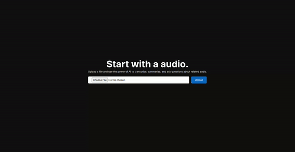

<p align="center">
  
</p>

# AudioInsight

AudioInsight is a full-stack application that processes audio, generates transcriptions, and allows users to ask questions about the related audio.

## How to Install

1. Start by cloning this repository:

```bash
git clone git@github.com:gabrielsenadev/audioinsight.git
```

2. Install dependencies:

```bash
npm ci
```
3. Configure your environment

See [Environment Variables](#environment-variables).

4. Run application

```bash
npm run dev
```

## Environment Variables

This application depends on some providers to work with ai and database. It has been developed with minimal provider dependency. So, if you prefer a different provider, you can easily switch.

### Cloudflare AI:

This application integrates with the Cloudflare AI ecosystem to utilize AI Models.

- CLOUDFLARE_ACCOUNT_ID
- CLOUDFLARE_API_TOKEN

### Netlify Blobs:

For storing audio data, this application relies on Netlify Blobs. You will need a Netlify Site and Account.

- NETLIFY_SITE_ID
- NETLIFY_TOKEN

### MongoDB:

MongoDB is used to store chats and chat messages.

- MONGODB_URL
- MONGODB_DATABASE

## Technologies and Tools

This application utilizes several features:

- Next.js: Frontend React Application and API Application
- Cloudflare AI: Interaction with Cloudflare AI Models
- MongoDB: Database to store chats and messages
- Netlify Blobs: To store audio files
- Zod: User input API validation
- Tabler Icons: Application icons
- Wavesurfer: Audio wave visualization player
