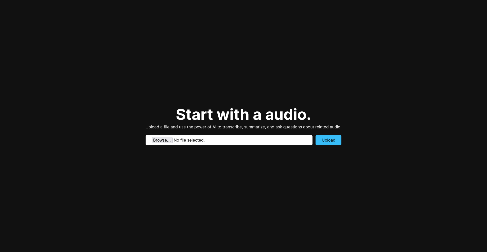
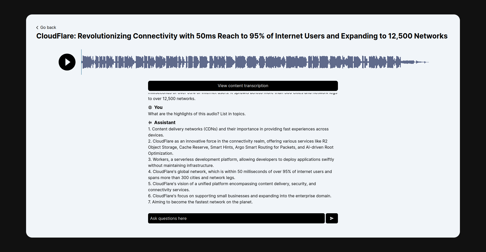

# AudioInsight - Cloudflare AI Challenge Entry

AudioInsight processes audio, transcribes it, summarizes it, generates a title for the content, and allows users to ask questions about the related audio.

This is an entry for the [Cloudflare AI Challenge](https://dev.to/challenges/cloudflare).

Live on: [https://audioinsight-4on.pages.dev](https://audioinsight-4on.pages.dev)

- [How It Works](#how-it-works)
- [How to Install](#how-to-install)
- [Audio Examples](#audio-examples)
- [Screenshots](#screenshots)

## How It Works

1. On the application's homepage, the user uploads an audio file.
2. We use the [whisper model](https://developers.cloudflare.com/workers-ai/models/whisper/) to transcribe the audio into text.
3. We use the [neural-chat-7b-v3-1-awq model](https://developers.cloudflare.com/workers-ai/models/neural-chat-7b-v3-1-awq/) to generate a title based on the provided content.
4. We summarize the content with the [bart-large-cnn model](https://developers.cloudflare.com/workers-ai/models/bart-large-cnn/).
5. After that, the user can ask questions, and we use the [neural-chat-7b-v3-1-awq model](https://developers.cloudflare.com/workers-ai/models/neural-chat-7b-v3-1-awq/) to answer the user's questions.

### Under the Hood

- [D1 Database](https://developers.cloudflare.com/d1/) is responsible for storing chat and its history.
- The [Cloudflare R2](https://developers.cloudflare.com/r2/) is responsible for storing chat's audio files.
- [Cloudflare Pages](https://developers.cloudflare.com/pages/) is responsible for hosting the entire [NextJS](https://nextjs.org/) application, which provides a front-end and back-end ecosystem.

## How to Install

1. Start by cloning this repository:

```bash
git clone git@github.com:gabrielsenadev/audioinsight.git
```

2. Install dependencies:

```bash
npm ci
```

3. Create D1 Database:

```bash
npx wrangler d1 create db-d1-audioinsight
```

4. Configure your database:

```bash
npx wrangler d1 execute db-d1-audioinsight --remote --file=./src/database/schema.sql
```

5. Create your R2 bucket:

```bash
npx wrangler r2 bucket create r2-audios
```

6. Update wrangler.toml to target your recently created database and bucket properly:

```toml
[[d1_databases]]
binding = "DB"
database_name = "db-d1-audioinsight"
database_id = "d485c019-8021-4d08-88e6-e5a6ea66ad4e"

[[r2_buckets]]
binding = 'R2'
bucket_name = 'r2-audios'
```

7. Run preview:

```bash
npm run preview
```

8. Deploy the application:


```bash
npm run deploy
```

## Audio Examples

In the examples/ directory, there are some useful audios to try this application.

## Screenshots

### Homepage


### Chat

